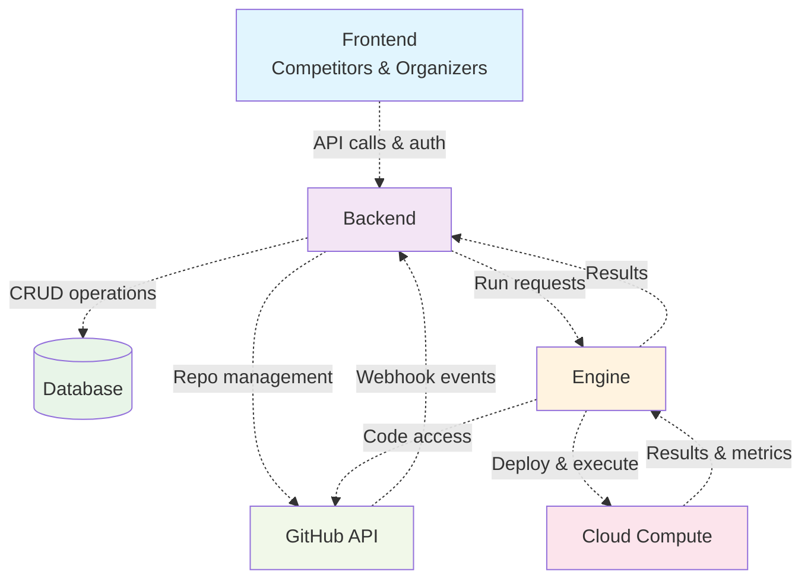

# Architecture Diagram

## Architecture Overview

### Components:
- **Frontend**: Web interface for both competitors and organizers
- **Backend**: Main server handling business logic and API endpoints
- **Database**: Data storage (only accessible through backend)
- **Engine**: Processing and execution engine
- **Cloud Compute**: Cloud computing resources
- **GitHub API**: External GitHub integration

### Connection Details:

#### 1. Frontend → Backend
- **Purpose**: User interface interactions
- **Actions**: API calls for user actions, authentication, real-time updates
- **Reason**: Centralized business logic and security

#### 2. Backend → Database
- **Purpose**: Data persistence and retrieval
- **Actions**: CRUD operations, user data, competition data
- **Reason**: Secure access control - only backend can access database

#### 3. Backend → GitHub API
- **Purpose**: Repository management
- **Actions**: Create competition repos, manage team access, webhook registration
- **Reason**: Centralized repo management for competitions

#### 4. GitHub API → Backend
- **Purpose**: Event notifications
- **Actions**: Push/pull events, issue creation, PR status updates
- **Reason**: Real-time updates on repository activities

#### 5. Engine → GitHub API
- **Purpose**: Code access for execution
- **Actions**: Clone competition repos, fetch latest code, access team submissions
- **Reason**: Need direct access to competition code for testing

#### 6. Engine ↔ Cloud Compute
- **Purpose**: Execution environment management
- **Actions**: Deploy competition environments, execute test runs, resource scaling
- **Reason**: Scalable computing resources for competition execution 