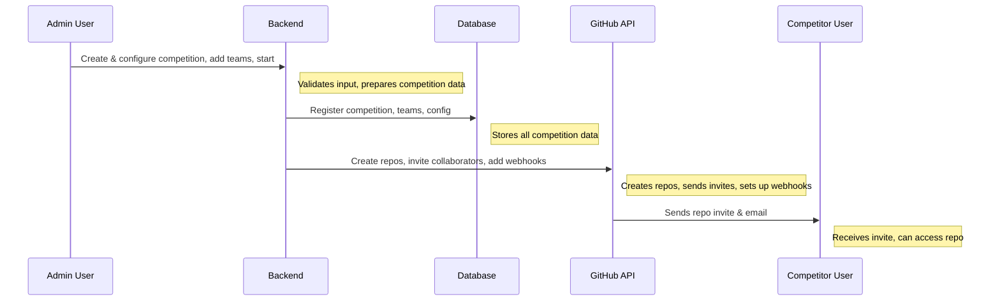
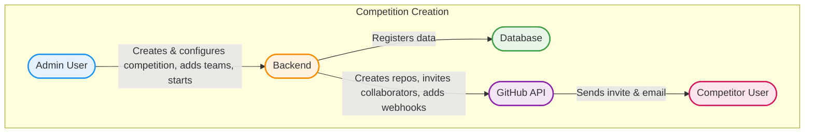
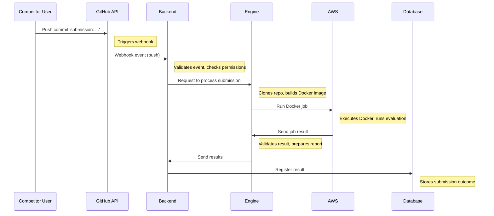
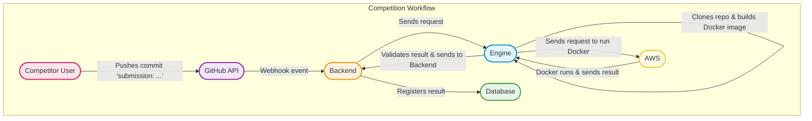

# Competition Flow

## Competition Creation

```mermaid
sequenceDiagram
    participant Admin as Admin User
    participant Backend as Backend
    participant DB as Database
    participant GitHub as GitHub API
    participant Competitor as Competitor User

    Admin->>Backend: Create & configure competition, add teams, start
    note right of Backend: Validates input, prepares competition data
    Backend->>DB: Register competition, teams, config
    note right of DB: Stores all competition data
    Backend->>GitHub: Create repos, invite collaborators, add webhooks
    note right of GitHub: Creates repos, sends invites, sets up webhooks
    GitHub->>Competitor: Sends repo invite & email
    note right of Competitor: Receives invite, can access repo
```

```mermaid
flowchart TD
    %% Competition Creation
    subgraph Competition Creation
        Admin([Admin User]) -->|Creates & configures competition, adds teams, starts| Backend([Backend])
        Backend -->|Registers data| DB([Database])
        Backend -->|Creates repos, invites collaborators, adds webhooks| GitHub([GitHub API])
        GitHub -->|Sends invite & email| Competitor([Competitor User])
    end

    %% Styling
    style Admin fill:#e3f2fd,stroke:#2196f3,stroke-width:2px
    style Backend fill:#fff3e0,stroke:#fb8c00,stroke-width:2px
    style DB fill:#e8f5e9,stroke:#43a047,stroke-width:2px
    style GitHub fill:#f3e5f5,stroke:#8e24aa,stroke-width:2px
    style Competitor fill:#fce4ec,stroke:#d81b60,stroke-width:2px
```

## On Submission

```mermaid
sequenceDiagram
    participant Competitor as Competitor User
    participant GitHub as GitHub API
    participant Backend as Backend
    participant Engine as Engine
    participant AWS as AWS
    participant DB as Database

    Competitor->>GitHub: Push commit 'submission: ...'
    note right of GitHub: Triggers webhook
    GitHub->>Backend: Webhook event (push)
    note right of Backend: Validates event, checks permissions
    Backend->>Engine: Request to process submission
    note right of Engine: Clones repo, builds Docker image
    Engine->>AWS: Run Docker job
    note right of AWS: Executes Docker, runs evaluation
    AWS->>Engine: Send job result
    note right of Engine: Validates result, prepares report
    Engine->>Backend: Send results
    Backend->>DB: Register result
    note right of DB: Stores submission outcome
```

```mermaid
flowchart TD
    %% Competition Workflow
    subgraph Competition Workflow
        Competitor([Competitor User]) -->|Pushes commit 'submission: ...'| GitHub([GitHub API])
        GitHub -->|Webhook event| Backend([Backend])
        Backend -->|Sends request| Engine([Engine])
        Engine -->|Clones repo & builds Docker image| Engine
        Engine -->|Sends request to run Docker| AWS([AWS])
        AWS -->|Docker runs & sends result| Engine
        Engine -->|Validates result & sends to Backend| Backend
        Backend -->|Registers result| DB([Database])
    end

    %% Styling
    style Backend fill:#fff3e0,stroke:#fb8c00,stroke-width:2px
    style DB fill:#e8f5e9,stroke:#43a047,stroke-width:2px
    style GitHub fill:#f3e5f5,stroke:#8e24aa,stroke-width:2px
    style Competitor fill:#fce4ec,stroke:#d81b60,stroke-width:2px
    style Engine fill:#e1f5fe,stroke:#0288d1,stroke-width:2px
    style AWS fill:#fffde7,stroke:#fbc02d,stroke-width:2px
```
