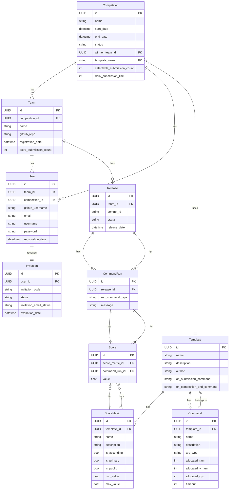
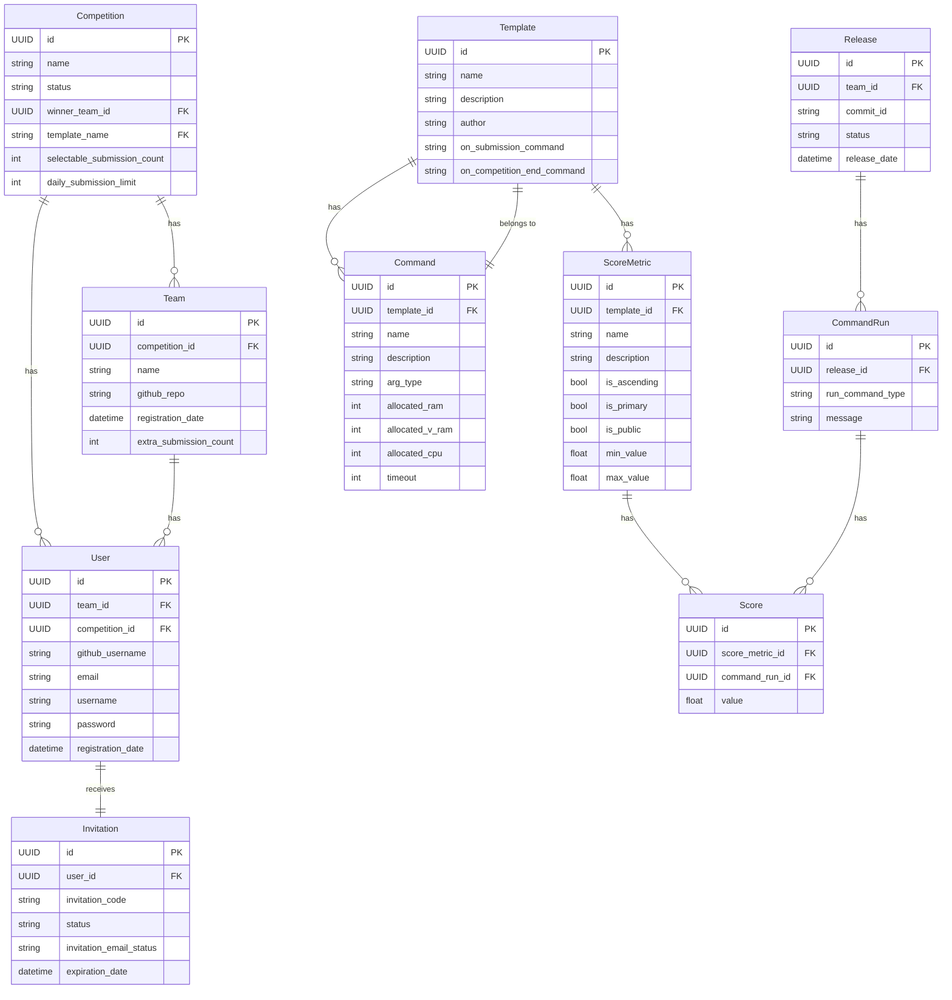

# Database Entity Relationship Diagram

```mermaid
erDiagram
    Competition {
        UUID id PK
        string name
        datetime start_date
        datetime end_date
        string status
        UUID winner_team_id FK
        string template_name FK
        int selectable_submission_count
        int daily_submission_limit
    }
    Team {
        UUID id PK
        UUID competition_id FK
        string name
        string github_repo
        datetime registration_date
        int extra_submission_count
    }
    User {
        UUID id PK
        UUID team_id FK
        UUID competition_id FK
        string github_username
        string email
        string username
        string password
        datetime registration_date
    }
    Invitation {
        UUID id PK
        UUID user_id FK
        string invitation_code
        string status
        string invitation_email_status
        datetime expiration_date
    }
    Template {
        UUID id PK
        string name
        string description
        string author
        string on_submission_command
        string on_competition_end_command
    }
    ScoreMetric {
        UUID id PK
        UUID template_id FK
        string name
        string description
        bool is_ascending
        bool is_primary
        bool is_public
        float min_value
        float max_value
    }
    Command {
        UUID id PK
        UUID template_id FK
        string name
        string description
        string arg_type
        int allocated_ram
        int allocated_v_ram
        int allocated_cpu
        int timeout
    }
    Release {
        UUID id PK
        UUID team_id FK
        string commit_id
        string status
        datetime release_date
    }
    CommandRun {
        UUID id PK
        UUID release_id FK
        string run_command_type
        string message
    }
    Score {
        UUID id PK
        UUID score_metric_id FK
        UUID command_run_id FK
        float value
    }

    Competition ||--o{ Team : has
    Competition ||--o{ User : has
    Competition }o--|| Template : "uses"
    Team ||--o{ User : has
    Team ||--o{ Release : has
    User ||--|| Invitation : "receives"
    Template ||--o{ ScoreMetric : has
    Template ||--o{ Command : has
    ScoreMetric ||--o{ Score : has
    Command ||--|| Template : "belongs to"
    Release ||--o{ CommandRun : has
    CommandRun ||--o{ Score : has
    CommandRun }o--|| Release : "for"
    Score }o--|| ScoreMetric : "for"
    Score }o--|| CommandRun : "for"
```

Here is a simplified version for better presentation:

```mermaid

erDiagram
    Competition {
        UUID id PK
        string name
        string status
        UUID winner_team_id FK
        string template_name FK
        int selectable_submission_count
        int daily_submission_limit
    }
    Team {
        UUID id PK
        UUID competition_id FK
        string name
        string github_repo
        datetime registration_date
        int extra_submission_count
    }
    User {
        UUID id PK
        UUID team_id FK
        UUID competition_id FK
        string github_username
        string email
        string username
        string password
        datetime registration_date
    }
    Invitation {
        UUID id PK
        UUID user_id FK
        string invitation_code
        string status
        string invitation_email_status
        datetime expiration_date
    }

    Competition ||--o{ Team : has
    Competition ||--o{ User : has
    Team ||--o{ User : has
    User ||--|| Invitation : "receives"

        Template {
        UUID id PK
        string name
        string description
        string author
        string on_submission_command
        string on_competition_end_command
    }
    ScoreMetric {
        UUID id PK
        UUID template_id FK
        string name
        string description
        bool is_ascending
        bool is_primary
        bool is_public
        float min_value
        float max_value
    }
    Command {
        UUID id PK
        UUID template_id FK
        string name
        string description
        string arg_type
        int allocated_ram
        int allocated_v_ram
        int allocated_cpu
        int timeout
    }
    Release {
        UUID id PK
        UUID team_id FK
        string commit_id
        string status
        datetime release_date
    }
    CommandRun {
        UUID id PK
        UUID release_id FK
        string run_command_type
        string message
    }
    Score {
        UUID id PK
        UUID score_metric_id FK
        UUID command_run_id FK
        float value
    }


    Template ||--o{ ScoreMetric : has
    Template ||--o{ Command : has
    ScoreMetric ||--o{ Score : has
    Command ||--|| Template : "belongs to"
    Release ||--o{ CommandRun : has
    CommandRun ||--o{ Score : has
```